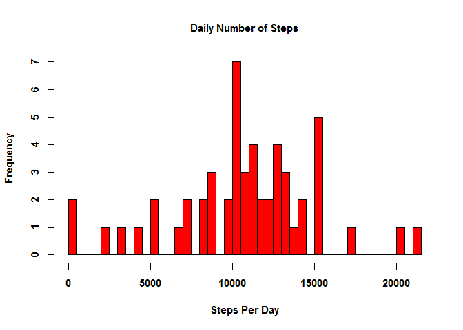
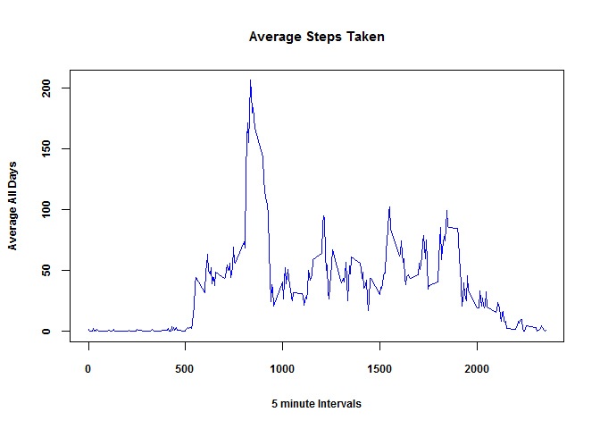
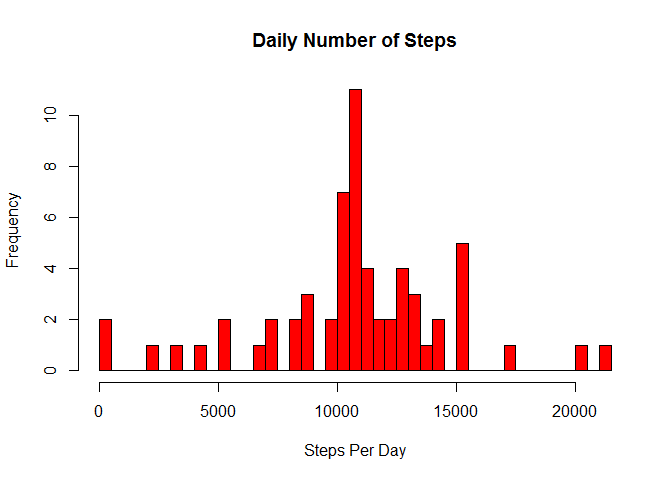
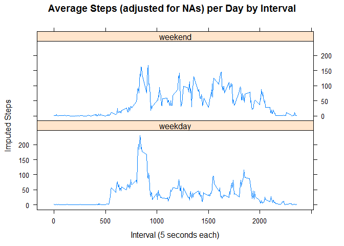

Instructions

Introduction

It is now possible to collect a large amount of data about personal
movement using activity monitoring devices such as a Fitbit, Nike
Fuelband, or Jawbone Up. These type of devices are part of the
"quantified self" movement - a group of enthusiasts who take
measurements about themselves regularly to improve their health, to find
patterns in their behavior, or because they are tech geeks. But these
data remain under-utilized both because the raw data are hard to obtain
and there is a lack of statistical methods and software for processing
and interpreting the data.

This assignment makes use of data from a personal activity monitoring
device. This device collects data at 5 minute intervals through out the
day. The data consists of two months of data from an anonymous
individual collected during the months of October and November, 2012 and
include the number of steps taken in 5 minute intervals each day.

The data for this assignment can be downloaded from the course web site:

Dataset: Activity monitoring data [52K] The variables included in this
dataset are:

steps: Number of steps taking in a 5-minute interval (missing values are
coded as NA) date: The date on which the measurement was taken in
YYYY-MM-DD format interval: Identifier for the 5-minute interval in
which measurement was taken The dataset is stored in a
comma-separated-value (CSV) file and there are a total of 17,568
observations in this dataset.

    # Read in data from file activity.csv
    activity <- read.csv("activity.csv", na.strings="NA")

    # Exclude NA
    activity$steps <- as.numeric(activity$steps)
    activity$interval <- as.numeric(activity$interval)

    # Calculate Total Number of Steps
    StepsTotal <- aggregate(steps ~ date, data=activity, sum, na.rm=TRUE)

Plot a histogram of Total Steps Per Day

Calculate and report Mean and Median for Total Steps Per Day

    ##    Min. 1st Qu.  Median    Mean 3rd Qu.    Max. 
    ##      41    8841   10760   10770   13290   21190

The next part answered the following question.

What is the average daily activity pattern?

A time series plot (i.e. type = "l") of the 5-minute interval (x-axis)
and the average number of steps taken, averaged across all days (y-axis)
was constructed.

    plot(row.names(time_series), time_series, type = "l", xlab = "5 minute Intervals", ylab="Average All Days", main="Average Steps Taken", col="blue", cex=1, cex.axis=0.75, cex.lab=0.75, cex.main=0.95, font.lab=2, font=2)

Which 5-minute interval, on average across all the days in the dataset,
contains the maximum number of steps?

    ## [1] "835"

Imputing missing values

There are a number of days/intervals where there are missing values
(coded as NA). The presence of missing days may introduce bias into some
calculations or summaries of the data.

Calculate and report the total number of missing values in the dataset
(i.e. the total number of rows with NAs)

    ## [1] 2304

The strategy used to fill in the missing values is to use the average \#
of steps for the 5-minute interval in which a NA appeared.

Here's a histogram of the Total Number of Steps per Day with the
adjustment for the NAs.

    hist(totalStepsperday2$steps, breaks = 40, col = "red", xlab = "Steps Per Day", main = "Daily Number of Steps")

Here's the Mean and Median for the total steps per day data adjusted for
NAs.

    ##    Min. 1st Qu.  Median    Mean 3rd Qu.    Max. 
    ##      41    9819   10770   10770   12810   21190

Create a new factor variable in the dataset with two levels - "weekday"
and "weekend" indicating whether a given date is a weekday or weekend
day. Make a panel plot containing a time series plot (i.e. type = "l")
of the 5-minute interval (x-axis) and the average number of steps taken,
averaged across all weekday days or weekend days (y-axis). See the
README file in the GitHub repository to see an example of what this plot
should look like using simulated data

    dAta$date <- as.Date(dAta$date)
    dAta$day <- weekdays(dAta$date)
    dAta$indicate_day <- as.factor(ifelse(dAta$day == "Saturday" | dAta$day == "Sunday", "weekend", "weekday"))

    StepsImputedInterval <- aggregate(steps ~ interval + indicate_day, dAta, mean)
    library(lattice)
    xyplot(StepsImputedInterval$steps ~ StepsImputedInterval$interval | StepsImputedInterval$indicate_day, main="Average Steps (adjusted for NAs) per Day by Interval", xlab="Interval (5 seconds each)", ylab="Imputed Steps", layout=c(1,2), type="l", cex=1, cex.axis=0.75, font=2, font.lab=2, font.main=2, font.sub=2, font.lab=2)

